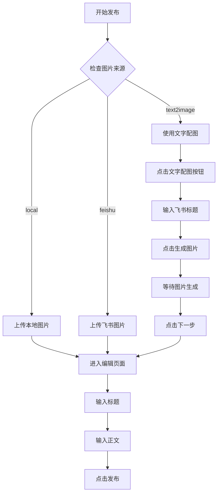

# Design Document: 文字配图发布功能

## Overview

本功能扩展现有的小红书自动发布系统，增加"文字配图"发布模式。该模式利用小红书创作者平台内置的文字配图功能，将飞书文档的标题自动生成为精美的图片卡片，然后完成发布流程。

## Architecture



## Components and Interfaces

### 1. 类型定义扩展 (src/types/index.ts)

```typescript
// 扩展图片来源类型
export type ImageSourceType = 'local' | 'feishu' | 'text2image';
```

### 2. MultiAccountPublisher 扩展

在 `publishOne` 方法中增加 `text2image` 分支：

```typescript
async publishOne(task: PublishTaskWithAccount): Promise<PublishResult> {
  // ... 现有代码 ...
  
  if (this.imageSource === 'text2image') {
    await this.useText2Image(page, task.title);
  } else if (this.imageSource === 'feishu') {
    // 现有飞书图片逻辑
  } else {
    // 现有本地图片逻辑
  }
}
```

### 3. 新增方法：useText2Image

```typescript
private async useText2Image(page: Page, title: string): Promise<void> {
  // 1. 点击文字配图按钮
  // 2. 等待弹窗打开
  // 3. 输入标题文字
  // 4. 点击生成图片
  // 5. 等待图片生成完成
  // 6. 点击下一步
}
```

### 4. CSS 选择器

```typescript
const TEXT2IMAGE_SELECTORS = {
  // 文字配图按钮
  text2imageBtn: '#web > div > div > div > div.upload-content > div.upload-wrapper > div > div > div > button.el-button.upload-button.text2image-button',
  // 文字输入框
  textInput: '#web > div > div > div > div.card-editor-container > div > div.edit-text-item-container > div > div.swiper-wrapper > div.swiper-slide.swiper-slide-active.text-editor-slide.focused > div > div.editor-content.content-mode > div > div > p',
  // 生成图片按钮
  generateBtn: '#web > div > div > div > div.card-editor-container > div > div.edit-text-button-container > div',
  // 下一步按钮
  nextBtn: '#web > div > div > div > div.image-editor-container > div.overview-footer > button',
};
```

## Data Models

### ImageSourceType 扩展

| 值 | 描述 |
|---|---|
| `local` | 使用本地合成的图片 |
| `feishu` | 使用飞书附件中的图片 |
| `text2image` | 使用小红书文字配图功能生成图片 |

## Correctness Properties

*A property is a characteristic or behavior that should hold true across all valid executions of a system-essentially, a formal statement about what the system should do. Properties serve as the bridge between human-readable specifications and machine-verifiable correctness guarantees.*

### Property 1: 发布模式决定图片处理方式
*For any* 发布任务，当 imageSource 设置为 'text2image' 时，系统应该调用文字配图流程而不是图片上传流程
**Validates: Requirements 1.1**

### Property 2: 文字配图使用正确的标题
*For any* 发布任务，当使用文字配图功能时，输入到文字配图输入框的文字应该等于任务的 title 字段
**Validates: Requirements 1.2**

### Property 3: 配置保存和读取一致性
*For any* imageSource 配置值，保存后重新加载应该得到相同的值
**Validates: Requirements 2.2**

### Property 4: 错误处理 - 元素未找到
*For any* 文字配图流程中的关键元素（按钮、输入框），如果元素未找到，系统应该返回包含错误信息的失败结果
**Validates: Requirements 3.1, 3.2, 3.4**

### Property 5: 错误处理 - 超时
*For any* 文字配图生成操作，如果超过指定时间未完成，系统应该返回超时错误
**Validates: Requirements 3.3**

## Error Handling

| 错误场景 | 处理方式 |
|---------|---------|
| 文字配图按钮未找到 | 记录错误日志，返回 `{ success: false, errorMessage: '文字配图按钮未找到' }` |
| 文字输入框未找到 | 记录错误日志，返回 `{ success: false, errorMessage: '文字输入框未找到' }` |
| 生成图片超时 | 等待最多30秒，超时后返回 `{ success: false, errorMessage: '生成图片超时' }` |
| 下一步按钮未找到 | 记录错误日志，返回 `{ success: false, errorMessage: '下一步按钮未找到' }` |

## Testing Strategy

### 单元测试
- 测试 ImageSourceType 类型定义正确
- 测试配置保存和读取

### 集成测试
- 测试完整的文字配图发布流程（需要实际浏览器环境）

### 属性测试
由于本功能主要涉及 UI 自动化操作，属性测试的适用性有限。主要通过集成测试验证功能正确性。
